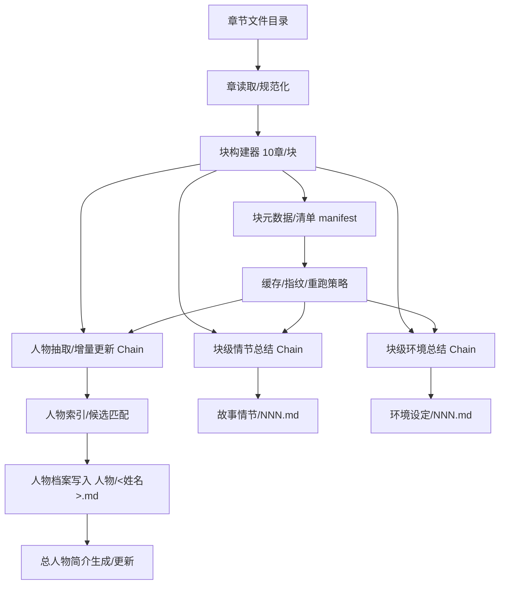

# 架构设计：基于 LangChain 的「AI 辅助小说拆解与创作素材沉淀系统」

本文档承接 `doc/AI辅助小说拆解.md` 的需求边界，给出一套**可落地、可迭代**的工程架构设计。系统目标是把长篇小说（按章纯文本）加工为面向人类阅读的三类材料：**人物档案**、**故事情节总结（10 章/份）**、**环境设定总结（10 章/份）**，并在可控 token 成本下支持持续增量更新。

---

## 1. 目标、非目标与核心约束

### 1.1 目标（Must）

- **生产线**：输入章节文本 → 以“10 章块”为工程处理单位 → 输出可读、可复用的创作素材文档。
- **三类核心产物**：
  - **人物**：一人一档、持续补充；另有 `总人物简介` 作为索引。
  - **故事情节**：每 10 章生成 1 份宏观总结（数字编号，文内含标题）。
  - **环境设定**：每 10 章生成 1 份总结（数字编号）。
- **可控成本**：chunk/摘要层级、缓存、去重、重试、模型选择策略可配置。
- **增量处理**：支持从第 \(N\) 章继续跑；支持对单个块重跑并覆盖/追加。

### 1.2 非目标（Not now）

- 不追求“AI 一次性全自动生成整本小说”。
- 不在第一阶段强行解决全书回扫修正、复杂人物同一性合并（仅提供接口与可扩展点）。
- 不以强结构化数据库为第一目标（以**文件**为核心产物）。

### 1.3 核心约束（来自需求）

- **块（processing block）**：默认 **10 章/块**，仅是工程处理单位，不等同事件单元。
- **输出面向人阅读**：强调条理与可复用启发，而非纯机器结构化。

---

## 2. 总体架构概览

系统采用“离线批处理 + 可重复运行”的架构：一次处理一个块（10章），每块产出 2 份块级总结（情节/环境）+ 若干人物档案的增量更新 + 总人物简介的增量维护。

### 2.1 逻辑组件图（Mermaid）



### 2.2 技术选型（建议）

- **运行语言**：Python（LangChain 生态成熟、集成丰富）。
- **编排方式**：LangChain LCEL（Runnable）/ Chains + 自定义 Orchestrator。
- **存储**（第一阶段）：
  - 产物：本地文件系统（Markdown）。
  - 元数据：本地 JSON（manifest、指纹、运行记录）。
  - 可选：轻量向量库（如 Chroma/FAISS）用于后续“人物同一性/别名”召回与跨块检索（第二阶段启用）。
- **可观察性**：结构化日志 + 每块运行报告（token/费用/耗时/失败原因）。

---

## 3. 目录结构（建议落盘形态）

与 `doc/AI辅助小说拆解.md` 的原则对齐，但把产物改为更利于维护的 Markdown（你也可保持 `.txt`，架构不变）。

```text
<project-root>/
├── doc/
│   ├── AI辅助小说拆解.md
│   └── 架构设计.md
├── novels/                       # 输入：小说（按章）
│   └── <book_id>/
│       ├── chapters/
│       │   ├── 第1章xxx.txt
│       │   ├── 第2章xxx.txt
│       │   └── ...
│       └── artifacts/            # 输出：产物（沉淀材料）
│           ├── 人物/
│           │   ├── 总人物简介.md
│           │   ├── 张三.md
│           │   └── ...
│           ├── 故事情节/
│           │   ├── 001.md
│           │   └── ...
│           ├── 环境设定/
│           │   ├── 001.md
│           │   └── ...
│           └── meta/
│               ├── manifest.json          # 章节→块映射、处理状态
│               ├── fingerprints.json      # 输入指纹/产物指纹
│               └── runs/
│                   ├── 2026-04-02T...json # 每次运行报告
│                   └── ...
├── prompts/                      # 提示词模板（可版本化）
│   ├── plot_summary.md
│   ├── setting_summary.md
│   ├── character_extract.md
│   ├── character_update.md
│   └── character_index.md
└── src/
    ├── cli.py                    # 命令行入口
    ├── config.py                 # 配置（模型、块大小、路径）
    ├── io/
    │   ├── chapter_loader.py     # 章读取/清洗
    │   ├── artifact_writer.py    # 产物写入（原子写/幂等）
    │   └── manifest.py           # manifest/fingerprint 管理
    ├── chains/
    │   ├── plot_chain.py
    │   ├── setting_chain.py
    │   ├── character_chain.py
    │   └── shared.py             # LLM、解析器、重试策略
    ├── domain/
    │   ├── models.py             # Block/Character/Artifact 数据结构
    │   └── matching.py           # 人物候选匹配（可插拔）
    └── orchestrator/
        ├── pipeline.py           # 端到端编排（按块）
        └── policies.py           # 缓存/重跑/降级策略
```

---

## 4. 数据模型（最小可用）

第一阶段尽量保持“轻结构 + 文档为王”，同时为增量与幂等提供必要元数据。

### 4.1 Block（处理块）

- **block_id**：`001`、`002`…（对应每 10 章一份情节/环境总结的编号）
- **chapter_range**：例如 `1-10`
- **chapter_files**：实际文件列表（避免重命名导致错位）
- **input_fingerprint**：对输入文本做 hash（用于缓存/重跑判断）
- **status**：`pending|done|failed`
- **artifacts**：本块输出文件路径与指纹

### 4.2 Character（人物档案的最小索引）

人物档案文件是主产物；索引用于“把本块提到的人归档到正确文件”。

- **primary_name**：主名（文件名）
- **aliases**：别名/称谓（第二阶段逐步完善）
- **first_seen_block**：首次出现的块
- **last_updated_block**：最近更新的块

---

## 5. LangChain 设计：Chains / Runnables 的拆分

核心原则：**块级总结（情节/环境）与人物增量更新解耦**，都以同一份块输入为源；产物写入由统一的 Writer 负责幂等与原子性。

### 5.1 输入准备（Loader + 规范化）

- **ChapterLoader**：
  - 读取章节文件（按文件名排序 + 读取 manifest 内的稳定顺序）
  - 统一编码/去除无意义广告行/章节头尾噪声（可配置规则）
  - 输出 `Chapter` 列表
- **BlockBuilder**：
  - 按 10 章打包为 `Block`
  - 生成 `block_text`（用于 LLM 输入）与 `block_context`（章名、范围等）

### 5.2 故事情节总结 Chain（PlotChain）

**输入**：`block_text` + `block_context`  
**输出**：`plot_summary_markdown`（包含“标题 + 事实摘要 + 结构分析 + 可复用启发”）

建议采用两步以控质量与 token：

- **Step A（事实摘要）**：压缩事件链、冲突—转折—结果、主支线推进（尽量客观）
- **Step B（结构分析/启发）**：提炼叙事结构、节奏、伏笔、人物推动作用与可复用技法

### 5.3 环境设定总结 Chain（SettingChain）

**输入**：`block_text` + `block_context`  
**输出**：`setting_summary_markdown`（地点/规则/资源/限制/氛围/可复用设定点）

同样建议“事实清单 + 设计启发”两段式，避免纯罗列。

### 5.4 人物抽取与增量更新 Chain（CharacterChain）

人物处理的难点不在“抽取名字”，而在于**持续补充同一人物档案**与**控制误合并/漏合并**。因此第一阶段建议采取“保守合并、允许重复、留痕可回溯”的策略。

**输入**：`block_text` + `block_context` +（可选）`character_index_snapshot`  
**输出**：

- `character_mentions`：本块出现/涉及的人物候选清单（含证据片段与不确定性标记）
- `character_updates`：对每个候选人物的“增量更新片段”（写入对应人物档案）
- `character_index_delta`：对总人物简介/索引的增量变化

建议拆为 3 个 runnable：

#### 5.4.1 抽取（Extract）

- 目标：从块中抽取“值得建档/更新”的人物候选，而不是泛化到所有路人甲。
- 输出字段建议（轻结构，便于解析与落盘）：
  - `name`（主名或最常用称呼）
  - `aliases`（本块出现的别名/称谓）
  - `role_guess`（主/配/反派/功能性角色；允许 `unknown`）
  - `evidence`（2-5 条原文引用片段，短句即可）
  - `confidence`（0-1 或 low/med/high）
  - `notes`（疑似同一人/疑似新角色/疑似仅路人）

#### 5.4.2 匹配（Match）

第一阶段（无向量库）推荐的保守匹配策略：

- **强匹配**：人物名与已有档案文件名完全一致 → 直接更新。
- **弱匹配（可选开关）**：别名命中、称谓命中、且 evidence 中有稳定身份信息 → 作为候选，交由 LLM 做“是否同一人”的二分类判断（并写入运行报告）。
- **无法匹配**：创建新档案（以 `name` 命名），同时在 `总人物简介` 中标记“可能重复/可能别名”。

> 关键点：宁可多建两个相似人物档案，也不要轻易误合并。误合并对二次创作的伤害更大。

#### 5.4.3 更新（Update）

对每个“已归属”的人物档案，使用 `character_update` 模板进行增量写作：

- **输入**：人物既有档案全文 + 本块人物相关 evidence（引用）+ 本块情节摘要（可选，节省引用抽取成本）
- **输出**：一段可直接追加到人物档案末尾的 Markdown（按块编号分节）
- **写入策略**：
  - 每个块在人物档案中形成独立小节：`## 来自块 001（第1-10章）`
  - 小节内部采用“客观事实 / 关系变化 / 成长与得失 / 可复用启发”四段（不必强字段化，但固定顺序）
  - 若本块没有新增信息，允许输出“无新增（略）”，Writer 可选择不写入

---

## 6. 产物模板（建议固定版式，便于长期维护）

模板的意义是让产物“可读、可快速扫视、可持续追加”。以下是推荐结构（提示词与 Writer 共同保证）。

### 6.1 故事情节 `artifacts/故事情节/NNN.md`

- 标题：`# <故事标题>（块 NNN / 第x-y章）`
- `## 客观事实摘要`：按事件链列点
- `## 结构分析`：冲突-升级-转折-结局（或阶段推进），主支线关系
- `## 可复用启发`：可迁移的叙事技法/结构套路/节奏控制点

### 6.2 环境设定 `artifacts/环境设定/NNN.md`

- 标题：`# 环境设定总结（块 NNN / 第x-y章）`
- `## 场景与地点`：地点清单 + 关键特征
- `## 规则与限制`：制度/修炼体系/资源规则/禁忌
- `## 资源与道具`：关键资源、可交易物、权力结构
- `## 氛围与叙事用途`：该环境如何服务冲突与情绪
- `## 可复用设定点`：可迁移到新作品的设定颗粒

### 6.3 人物档案 `artifacts/人物/<姓名>.md`

- 标题：`# <姓名>`
- `## 基础信息`：身份、定位、外观/气质（稳定描述）
- `## 关系`：与核心人物的关系（允许粗粒度）
- `## 成长脉络（时间线）`：按块追加
  - `## 来自块 NNN（第x-y章）`：事实/变化/得失/启发
- `## 可复用角色路线`：抽象成“可迁移的人物弧线”

### 6.4 总人物简介 `artifacts/人物/总人物简介.md`

- `# 总人物简介`
- `## 核心人物索引`：主角团/反派/重要配角（带链接）
- `## 人物速览表`：姓名 / 一句话定位 / 首次出现块 / 近期状态
- `## 待澄清与可能重复`：疑似同一人、别名、信息冲突列表（第一阶段很重要）

---

## 7. 幂等、缓存与重跑策略

长篇小说处理必然要“可重复跑”。系统设计应避免重复消耗 token，并在出错时能从块级恢复。

### 7.1 指纹（Fingerprint）

- **输入指纹**：对每个块的 `block_text` 做 hash（如 SHA256）
- **提示词指纹**：对 prompt 文件内容做 hash（提示词改了就应触发重跑）
- **模型指纹**：模型名 + 关键参数（temperature、max_tokens 等）
- 组合形成 `job_fingerprint`：用于判断是否可直接复用历史产物

### 7.2 缓存层次

- **块级缓存**：若 `job_fingerprint` 未变且产物存在 → 跳过该块。
- **子任务缓存**：情节/环境/人物更新可以分别缓存，允许只重跑其中一类。
- **LLM 调用缓存（可选）**：LangChain 内置 cache（如 SQLiteCache）用于开发调试期降本。

### 7.3 重跑策略（覆盖 vs 追加）

- **情节/环境**：通常覆盖重写（因为是块级总结，版本一致性更重要）。
- **人物档案**：
  - 默认追加（按块小节追加，历史可追溯）。
  - 若重跑同一块，Writer 可先删除该人物档案中对应块小节再写入（保持幂等）。

---

## 8. Orchestrator：按块编排的流水线

### 8.1 处理顺序（建议）

- 先跑 **PlotChain / SettingChain**（产出块级总结）
- 再跑 **CharacterChain**（可把块级总结作为额外上下文，减少人物抽取难度与 token）
- 最后更新 **总人物简介**（基于人物索引/人物档案摘要生成）

### 8.2 失败处理

- 单块失败不影响其他块（记录到 `runs/<timestamp>.json`）。
- 对 LLM 请求设置：
  - 指数退避重试（网络/限流）
  - 输出解析失败的“回退提示”（例如要求模型按严格 JSON/Markdown 模板重答）
- 失败块可通过 CLI 指定 `--blocks 12,13` 重跑。

---

## 9. 对外接口（CLI 为主，后续可加 Web）

第一阶段建议先做 CLI，原因：离线批处理、可脚本化、易复跑。

### 9.1 CLI 命令建议

- `novelagent init <book_id>`：初始化目录、manifest、提示词模板拷贝
- `novelagent ingest <book_id>`：扫描章节文件，生成/更新 manifest（章序、缺失检测）
- `novelagent run <book_id> --from 1 --to 120 --block-size 10`：执行拆解
- `novelagent rerun <book_id> --blocks 001,002 --tasks plot,character`：选择性重跑
- `novelagent report <book_id> --last`：查看最近一次运行报告（token/费用/失败块）

### 9.2 配置项（最小集合）

- 模型：`LLM_MODEL_PLOT / LLM_MODEL_SETTING / LLM_MODEL_CHARACTER`
- 块大小：`BLOCK_SIZE=10`
- 产物格式：`OUTPUT_FORMAT=md|txt`
- 缓存：`ENABLE_CACHE=true`、`CACHE_BACKEND=sqlite|none`
- 语言风格：`STYLE=严谨|偏创作启发`

---

## 10. 第二阶段演进路线（与需求中的“未定稿部分”对齐）

### 10.1 人物同一性与别名合并（高优先）

- 增加 `character_index.json`（轻结构索引）与别名表
- 启用向量检索（Chroma/FAISS）：
  - 对人物档案摘要做 embedding
  - 把本块新人物候选去检索 top-k 近邻，交由 LLM 做“是否同一人/是否别名”判定
- 引入“人工审阅点”（可选）：输出 `待确认清单.md`

### 10.2 全书回扫修正机制（中优先）

- 以“人物/设定”为中心做回扫：
  - 发现人物信息冲突 → 触发跨块检索 → 生成“冲突对照与修订建议”
  - 设定前后不一致 → 标记“疑似吃书点/伏笔回收”

### 10.3 更细粒度模板与质量评估（中优先）

- 为三类产物引入质量检查 chain：
  - 覆盖度（是否漏掉关键转折）
  - 一致性（人名/地名统一）
  - 可复用性（启发段是否具体可迁移）

---

## 11. 风险与对策（务实版）

- **token 成本过高**：块级并行 + 缓存 + 用块级总结辅助人物抽取；必要时把人物抽取限制为“重要人物”。
- **误合并人物**：第一阶段保守合并、允许重复；把“可能重复”显式写入总人物简介。
- **输出漂移（风格不一致）**：提示词模板版本化 + 固定版式 + 在每次运行报告里记录 prompt 指纹。
- **长跑不稳定**：块级断点续跑 + 失败块重试/重跑 + 原子写入避免半成品覆盖。

